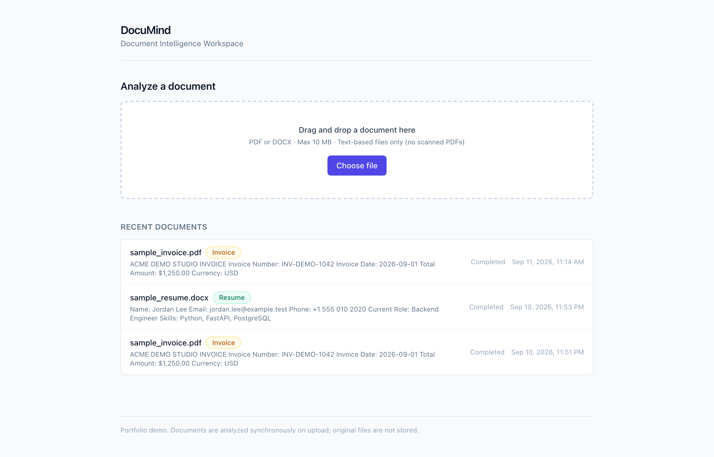
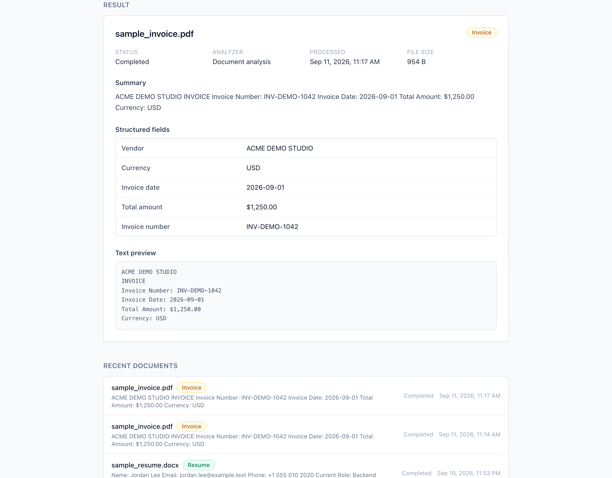
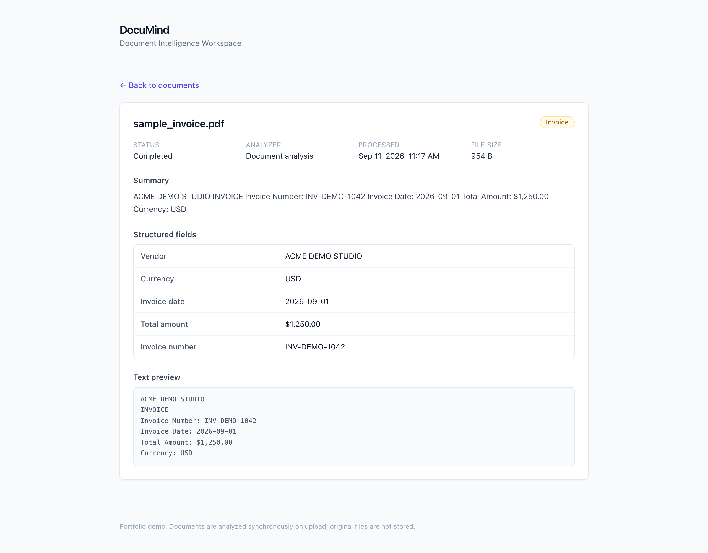
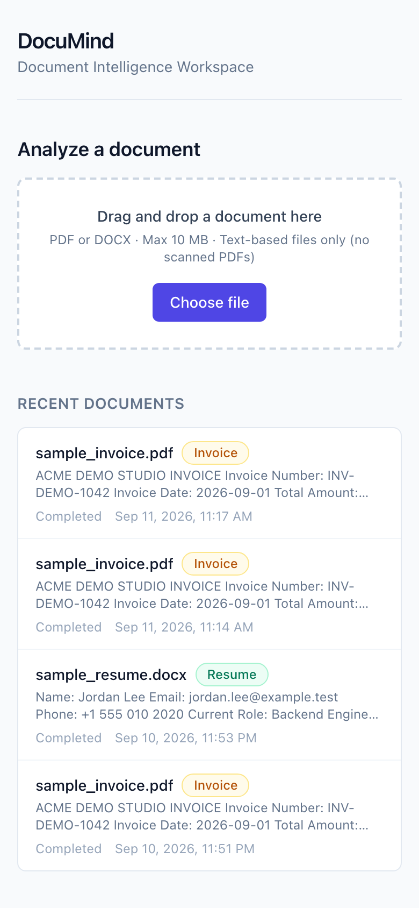

# DocuMind

**A document-intelligence portfolio demo: turn an uploaded business document into
structured, reviewable data.**

You upload a PDF or DOCX, DocuMind extracts its text, classifies it, summarizes it, and
pulls out a small set of type-specific structured fields — then persists the result so it
can be reopened later from a Recent Documents list.

- **Who it's for:** teams that receive documents (invoices, contracts, resumes) as PDFs
  or Word files and want a taste of turning them into structured, queryable records
  instead of re-reading each one by hand.
- **The problem it solves:** business documents arrive semi-structured; downstream work
  (bookkeeping, review, search) needs structured data, not another PDF to open.
- **What you can try:** upload the included sample invoice, watch it get classified and
  broken into fields in real time, then reopen the saved result from Recent Documents.
- **How to run it:** one `docker compose up --build` — see [Run locally](#run-locally).

> Portfolio demo. The default analyzer is a deterministic, offline, heuristic process —
> not a call to a real AI model. See [Analyzer: demo vs. optional OpenAI mode](#analyzer-demo-vs-optional-openai-mode).

## The problem

Business documents — invoices, contracts, resumes — usually arrive as PDFs or Word
files: readable by a person, but not directly usable by anything downstream. Someone
still has to open each file, find the vendor, the total, the date, and copy it somewhere
structured. DocuMind demonstrates automating that first step.

## The solution

DocuMind is a small full-stack workflow that uploads a document, extracts its text,
maps the content into a normalized shape (a document type plus a handful of relevant
fields), and persists the result so it's reviewable later — with the original file
discarded and the full extracted text kept instead.

## Core workflow

`Upload → Extraction → Structured analysis → Persistence → Recent Documents → Detail review`

1. **Upload** a text-based PDF or DOCX (up to 10 MB) on the homepage.
2. **Extraction** pulls the document's text synchronously, inside the same request.
3. **Structured analysis** classifies the document (invoice / contract / resume / other),
   writes a short summary, and extracts type-specific fields (e.g. vendor, invoice
   number, and total for an invoice).
4. **Persistence** stores the metadata, the full extracted text, and the normalized
   result in PostgreSQL. The original uploaded file is not kept.
5. **Recent Documents** lists the latest uploads so any result can be reopened.
6. **Detail review** shows the full result — including a preview of the extracted text —
   on its own page, reachable from Recent Documents or a direct link.

## What the demo proves

- A real file upload accepted and validated by a real backend (type and 10 MB limit
  enforced server-side, not just in the UI).
- Real text extraction from the uploaded PDF/DOCX (no placeholder or hard-coded content).
- Structured field extraction that varies by detected document type.
- Real persistence: the result is written to PostgreSQL and survives navigation/reload,
  not just kept in the browser tab.
- A working Recent Documents list backed by the same database.
- A working document detail page that reopens a previously persisted record.

## Analyzer: demo vs. optional OpenAI mode

The default and only mode used by this demo is `ANALYZER_MODE=demo`: **deterministic,
heuristic, fully offline, no API key required.** It is not a call to a real AI model, and
this README does not claim otherwise. It's what makes the demo runnable by anyone with
Docker and no credentials.

The codebase also has an optional `ANALYZER_MODE=openai` path that swaps in an OpenAI
call behind the identical output contract, selected explicitly via configuration
(`OPENAI_API_KEY` + `OPENAI_MODEL`). It is not enabled in this demo and is not
demonstrated here.

## Demo walkthrough

An exact, short walkthrough using the included sample invoice is in
[`docs/DEMO.md`](docs/DEMO.md).

## Screenshots

| Upload + Recent Documents | Structured result |
| --- | --- |
|  |  |

| Document detail (reopened) | Mobile |
| --- | --- |
|  |  |

## Architecture / stack

| Layer | Technology |
| --- | --- |
| Backend | FastAPI + PostgreSQL (SQLAlchemy, Alembic). Processing is synchronous inside `POST /api/documents` — no queues or workers. |
| Frontend | Next.js (App Router) + TypeScript + Tailwind CSS |
| Local orchestration | Docker Compose (`db`, `backend`, `frontend`) |

Two frontend routes (`/` and `/documents/[id]`) and four API endpoints (`GET /health`,
`POST /api/documents`, `GET /api/documents`, `GET /api/documents/{id}`) — no more. The
full frozen API and data contract is in [`docs/api-contract.md`](docs/api-contract.md).

## Run locally

```bash
cp .env.example .env
docker compose up --build
```

- Frontend: http://localhost:3001
- Backend: http://localhost:8001
- Health: http://localhost:8001/health

The backend container applies Alembic migrations before starting the API. To run only
the backend stack while frontend work is in progress:

```bash
docker compose up --build db backend
```

A sample document is included at [`samples/sample_invoice.pdf`](samples/sample_invoice.pdf)
for the walkthrough in `docs/DEMO.md`.

## Portfolio scope / limitations

This is a **portfolio demo**, not a production document-processing product:

- Everything shown is real: a real FastAPI backend, real text extraction, real
  PostgreSQL persistence, and a real Next.js UI — but the default analysis is
  deterministic/heuristic, not a live AI call (see above).
- Text-based PDF and DOCX only, up to 10 MB. No OCR — scanned/image-only PDFs are
  rejected, not silently mishandled.
- Original uploaded files are not retained after processing; only the extracted text and
  structured result are stored.
- No authentication, multi-user workspace, search, tagging, or document editing.
- No invented customers, usage volume, or accuracy claims — this README describes only
  what the running application actually does.

See [`docs/CASE_STUDY.md`](docs/CASE_STUDY.md) for the fuller write-up.
